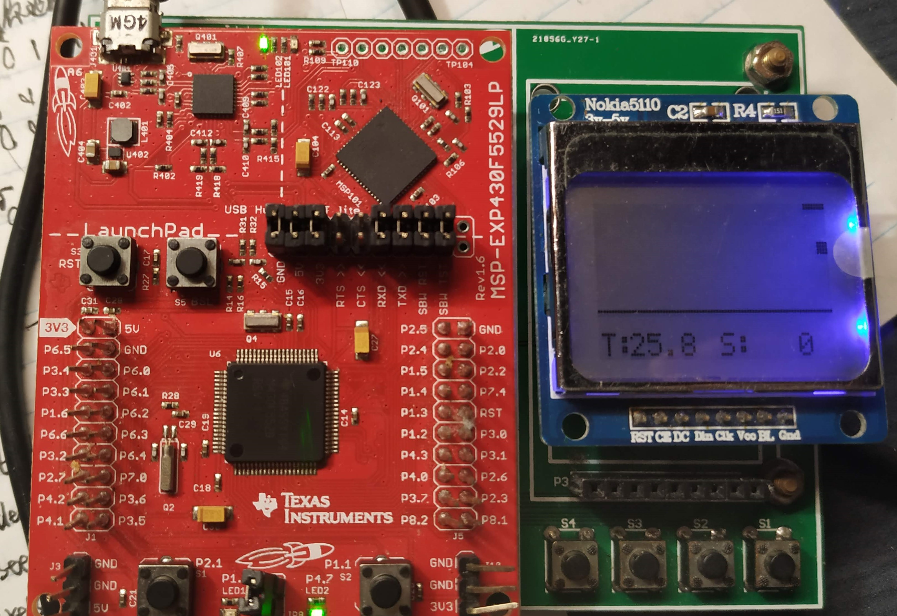
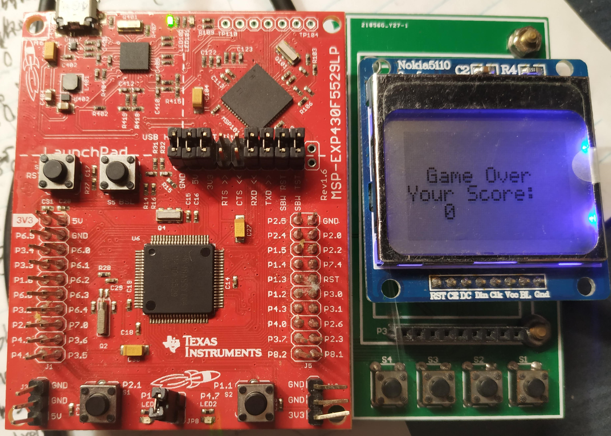

# MSP430F5529_Tetris

This is a project base on MSP430 LaunchPad, and you can play Tetris and see your score on the LCD5110. The project uses TI-RTOS, and there are two tasks running on the board, one is a task to manage the display and the another one is to send the signal to tell the task that there is a key being pressed. The system can display best score after the game over, however, after restart, the score will be erased.

## Connection
LCD5110 and MSP430F5229 connection

| Pin (LCD5110)   |  MSP430F5529    |
|---------------|:-----:|
| Reset         |  P3.7 |
| Chip Select   |  P2.5 |  
| Data/Command  |  P2.4 |
| Data Input    |  P8.1 |
| Clock         |  P8.2 | 
 
MSP430F5529 Button Connection:

| Buttons   |  MSP430F5529    |
|-----------|:-----:|
| Down (S1)    |  P1.4 |
| Right (S2)    |  P1.3 |
| Left (S3)    |  P1.2 |
| Up (S4)       |  P4.3 |

## Picture of the Board

    
     
    
Playing

    
     
    
Game over

